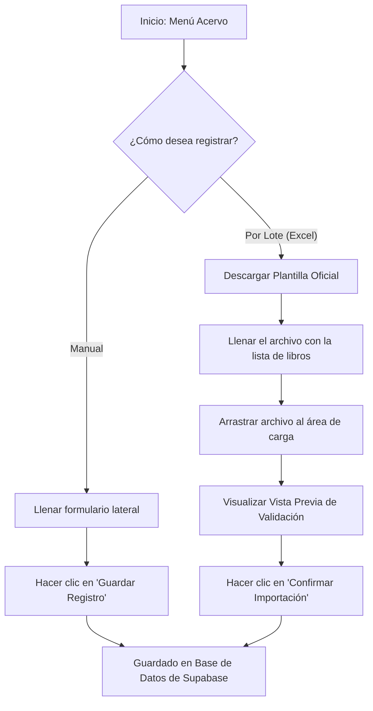
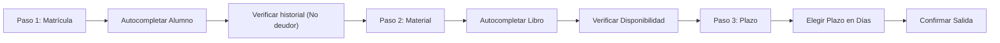

# 📖 Manual Funcional de Usuario - SGBU
### Sistema de Gestión de Biblioteca Universitaria - Universidad Lux

Este documento describe de manera clara y sencilla el funcionamiento general de la aplicación **SGBU**, explicando paso a paso los flujos operativos clave diseñados para bibliotecarios, auxiliares y administradores de la biblioteca de la Universidad Lux.

---

## 🧭 1. Panel de Control (Dashboard)
El **Dashboard** es la pantalla principal que se muestra tras iniciar sesión. Sirve como centro de monitoreo general y rápido del estado de la biblioteca:

* **Tarjetas de Estadísticas Reales (KPIs):** Muestra el total de libros catalogados, la cantidad de préstamos activos (fuera de la biblioteca), el número de libros vencidos y los alumnos registrados en el sistema. Todo se actualiza de forma automática en tiempo real desde la base de datos.
* **Accesos Rápidos:** Botones de acceso directo a tareas comunes (Registrar alumno, registrar libro, crear boleta de préstamo, escanear ubicación, ver inventario y reportes).
* **Actividad Reciente:** Un historial en tiempo real con las últimas 5 acciones completadas (ej. registros, devoluciones, préstamos).
* **Próximas Devoluciones:** Un listado ordenado cronológicamente de los libros que están por devolverse. Si a un libro le quedan 2 días o menos para vencer, el sistema lo resalta en rojo parpadeante para alertar al operador.

---

## 📚 2. Gestión de Libros y Tesis (Acervo)
Este módulo permite catalogar nuevos materiales y consultar el catálogo físico de la biblioteca.

### Flujo A: Búsqueda Inteligente (Lazy Search)
1. Escribe en el buscador del catálogo. Para evitar filtros innecesarios o saltos en pantalla, el buscador no se activará si escribes solo 1 o 2 letras (mostrará la alerta: `⚠️ Mínimo 3 letras para filtrar...`).
2. Al ingresar el **tercer carácter**, la tabla filtrará automáticamente buscando coincidencias por **Título, Autor, ISBN o Ubicación**.

### Flujo B: Registro Individual
1. En el panel izquierdo, rellena el formulario con el título, autor, año, carrera correspondiente, asesor (si es tesis) y la ubicación del estante.
2. Haz clic en **Guardar Registro**. El libro se guardará con un identificador único (ISBN) y estará disponible de inmediato.

### Flujo C: Importación Masiva (Excel)
1. Haz clic en **Descargar Plantilla Excel** para obtener el formato correcto de columnas (`ISBN`, `Título`, `Autor`, `Año`, `Licenciatura`, `Asesor`, `Ubicación`).
2. Rellena el archivo con tu inventario.
3. Arrastra o selecciona el archivo en el recuadro **Carga Masiva (Excel)**.
4. Revisa la **Vista Previa de Importación** en la ventana flotante que muestra todos los libros leídos.
5. Haz clic en **Confirmar Importación**. El sistema guardará todos los libros en bloque.

---

## 🔄 3. Préstamos y Devoluciones (Circulación)
Este es el flujo central de operación de la biblioteca para controlar la entrada y salida de material.

### Flujo A: Registrar un Nuevo Préstamo (Salida)
El sistema utiliza un asistente de 3 pasos sencillos para evitar errores operativos:

1. **Paso 1 (Usuario):** Digita las primeras 3 letras o números del alumno. El buscador autocompletará sus datos. Al seleccionarlo, el sistema verifica que no tenga reportes de morosidad. Si el alumno está libre de deudas, avanza automáticamente al paso 2.
2. **Paso 2 (Material):** Escribe el título o ISBN del libro. El autocompletado te mostrará los libros disponibles. Selecciónalo y pasará al paso 3.
3. **Paso 3 (Plazo):** Utiliza la barra deslizante para definir los días autorizados (desde 3 hasta 21 días). Haz clic en **Confirmar Préstamo**. El libro cambia su estado a `"Prestado"`.

### Flujo B: Registrar una Devolución (Retorno)
1. En el panel derecho de devoluciones, escribe las primeras 3 letras del Folio del préstamo, título del libro, matrícula o nombre del alumno.
2. Selecciona la boleta correspondiente de la lista de sugerencias.
3. El sistema carga los detalles del préstamo:
   * **Si está a tiempo:** Muestra el botón para liberar el material directamente.
   * **Si está vencido:** Muestra una alerta de recargo roja indicando el monto exacto a cobrar al alumno (`Días de retraso x Tarifa diaria`).
4. Cobra la multa (si aplica) y haz clic en **Registrar Devolución**. El libro vuelve a estar `"Disponible"` en su estante de inmediato.

---

## 📍 4. Mapa de Ubicaciones y Códigos QR
Permite organizar el inventario y auditar estanterías físicamente.

* **Mapa Visual:** La pantalla muestra las estanterías de la biblioteca divididas en 3 Estantes, cada uno con 3 Niveles (ej: `E1N1`, `E1N2` ... `E3N3`).
* **Indicador de Densidad:** Cada celda muestra exactamente cuántos libros del inventario están físicamente en esa coordenada.
* **Descarga e Impresión de QR:** Al seleccionar un nivel del estante, el sistema genera de manera autónoma un **código QR real y escaneable** que codifica la ubicación física del estante. Este código QR se dibuja utilizando la paleta de colores institucional y puede ser descargado como imagen o impreso directamente para pegarlo en los estantes físicos de la biblioteca. Al ser escaneado con cualquier teléfono móvil, se leerá el código de ubicación correspondiente (ej: `E1N1`), ayudando en la auditoría física del material.
* **Imprimir Inventario:** Genera un listado de control ordenado de todos los libros ubicados en la celda seleccionada.

---

## 📊 5. Reportes y Conclusiones Inteligentes
Este módulo ayuda a la toma de decisiones directivas mediante el análisis automático de los datos:

* **Gráficas de Uso por Licenciatura:** Muestra visualmente qué facultades o carreras están solicitando más libros prestados.
* **Libros Más Solicitados:** Un ranking interactivo del Top 4 de títulos más circulados.
* **Historial de Circulación Detallado:** Tabla de auditoría donde se pueden filtrar los préstamos totales, activos y vencidos.
* **Exportación de Datos:** Botones para simular descargas en formato PDF y Excel.
* **Conclusiones del Sistema (Insights Inteligentes):** Un asistente analítico inteligente que interpreta los datos de tu Supabase:
  * Si detecta préstamos vencidos, te avisa cuántos hay y te sugiere hacer labor de cobranza.
  * Si detecta alta circulación en una carrera específica, calcula el porcentaje de demanda y te recomienda qué libros reubicar a estantes de más fácil acceso para optimizar el flujo físico de la biblioteca.

---

## ⚙️ 6. Ajustes del Sistema
Permite a los administradores calibrar las políticas operativas de la biblioteca de manera centralizada:

1. **Multa por día de retraso:** Define el cobro diario (en pesos mexicanos MXN) acumulado por cada día de mora tras el vencimiento.
2. **Plazo predeterminado:** Ajusta el número de días sugerido al realizar un préstamo (usualmente 7 días).
3. **Límite de préstamos simultáneos:** Configura el número máximo de libros que un estudiante puede tener en su posesión al mismo tiempo (ej: máximo 3 libros).
